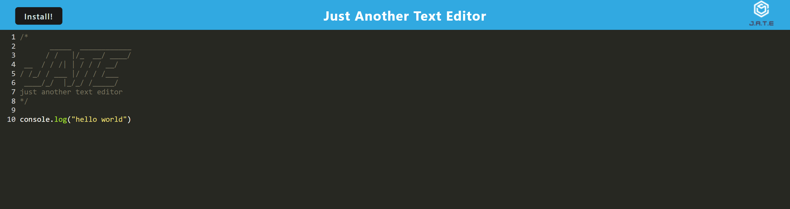

# progressive-web-application

 ## Table of Contents
  ### *[description](#description)
  ### *[Installation](#install)
  ### *[Usage](#usage)
  ### *[License](#license)
  ### *[Contributing](#Contributing)
  ### *[Questions](#questions)

  ## visuals
  
  ## description:
  This application makes the dysfunctional app that I was given to start with work
  ## Installation:
  You need to run a npm install on the main and server and client then run npm start and it will start both the server and build the webpack.
  ## Usage
  The purpose of this app is to make a functional app while offline and online that will update your information when you are back online.
  ## License
  MIT
  ## Contributing
  [gfinnie01](https://github.com/gfinnie01)

  ## Questions
  [gfinnie01](https://github.com/gfinnie01)